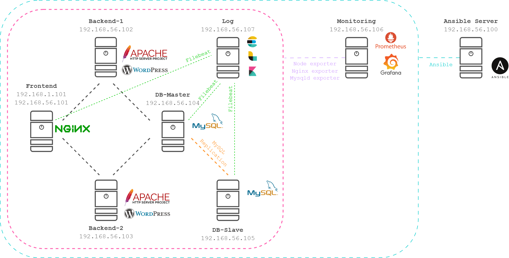

# otus_prof_project
## Задание
Необходимо развернуть веб проект, состоящий из нескольких виртуальных машин, и отвечающий следующим требованиям:
- включен HTTPS
- настроен Firewall
- настроен мониторинг со сбором метрик и уведомлениями
- организован централизованный сбор логов
- организовано резервное копирование

## Выполнение
Стенд для выполнения проект разворачивается в **VirtualBox** с помощью **Vagrant** с использование образа ОС _Ubuntu 22.04_. Создание виртуальных машин инициализируется командой:
```bash
vagrant up
```
### Описание инфраструктуры
| Server Name    | Private IP-address | Public IP-address | RAM    | CPU | Description                  |
|----------------|--------------------|-------------------|--------|-----|------------------------------|
| **Frontend**   | 192.168.56.101     | 192.168.1.101     | 512 Mb | 1   | Frontend web server          |
| **Backend-1**  | 192.168.56.102     | -                 | 768 Mb | 1   | Backend web server           |
| **Backend-2**  | 192.168.56.103     | -                 | 768 Mb | 1   | Backend web server           |
| **DB_Master**  | 192.168.56.104     | -                 | 1 Gb   | 1   | MySQL Server Master          |
| **DB_Slave**   | 192.168.56.105     | -                 | 1 Gb   | 1   | MySQL Server Replica         |
| **Monitoring** | 192.168.56.106     | -                 | 1 Gb   | 2   | Monitoring server. GAP Stack |
| **Log**        | 192.168.56.107     | -                 | 4 Gb   | 4   | Log Server. ELK Stack        |

- **Frontend** - фронтэнд веб сервер. _Nginx_.  
- **Backend-1 / Backend - 2** - бекэнд веб сервера. _Apache_, _WordPress_.  
- **DB-Master** - сервер БД _MySQL_ для WordPress  
- **DB-Slave** - сервер БД _MySQL_. Репликация с _DB-Master_.  
- **Monitoring** - сервер мониторинга. _Prometheus_, _Grafana_, _Alertmanager_.  
- **Log** - сервер сбора логов. _Elasticsearch_, _Logstash_, _Kibana_.
  
### Карта сети

### Правила Firewall
| Server                        | In Interface  | Protocol | Port       | Source          | Destination     | Action  | State               | Description                |
|-------------------------------|---------------|----------|------------|-----------------|-----------------|---------|---------------------|----------------------------|
| **Frontend**                  | lo            | All      | Any        | 0.0.0.0/0       | 0.0.0.0/0       | Accept  |                     | Accept traffic to loopback |
|                               | any           | All      | Any        | 0.0.0.0/0       | 0.0.0.0/0       | Accept  | Established Related | Accepted established       |
|                               | any           | All      | Any        | 0.0.0.0/0       | 0.0.0.0/0       | Drop    | Invalid             | Drop invalid               |
|                               | enp0s8        | TCP      | 22         | 0.0.0.0/0       | 0.0.0.0/0       | Accept  | New                 | SSH                        |
|                               | enp0s9        | TCP      | 80, 443    | 0.0.0.0/0       | 0.0.0.0/0       | Accept  |                     | HTTP / HTTPS               |
|                               | enp0s8        | TCP      | 80, 443    | 0.0.0.0/0       | 0.0.0.0/0       | Accept  |                     | HTTP / HTTPS               |
|                               | enp0s8        | TCP      | 9100       | 192.168.56.106  | 0.0.0.0/0       | Accept  |                     | Node exporter              |
|                               | enp0s8        | TCP      | 9113       | 192.168.56.106  | 0.0.0.0/0       | Accept  |                     | Nginx exporter             |
|                               | any           | ICMP     | Any        | 0.0.0.0/0       | 0.0.0.0/0       | Accept  |                     | Accept ICMP                |
|                               |               |          |            |                 |                 |         |                     |                            |
| **Backend-1** / **Backend-2** | lo            | All      | Any        | 0.0.0.0/0       | 0.0.0.0/0       | Accept  |                     | Accept traffic to loopback |
|                               | any           | All      | Any        | 0.0.0.0/0       | 0.0.0.0/0       | Accept  | Established Related | Accepted established       |
|                               | any           | All      | Any        | 0.0.0.0/0       | 0.0.0.0/0       | Drop    | Invalid             | Drop invalid               |
|                               | enp0s8        | TCP      | 22         | 0.0.0.0/0       | 0.0.0.0/0       | Accept  | New                 | SSH                        |
|                               | enp0s8        | TCP      | 80, 443    | 0.0.0.0/0       | 0.0.0.0/0       | Accept  |                     | HTTP / HTTPS               |
|                               | enp0s8        | TCP      | 9100       | 192.168.56.106  | 0.0.0.0/0       | Accept  |                     | Node exporter              |
|                               | any           | ICMP     | Any        | 0.0.0.0/0       | 0.0.0.0/0       | Accept  |                     | Accept ICMP                |
|                               |               |          |            |                 |                 |         |                     |                            |
| **DB-Master**                 | lo            | All      | Any        | 0.0.0.0/0       | 0.0.0.0/0       | Accept  |                     | Accept traffic to loopback |
|                               | any           | All      | Any        | 0.0.0.0/0       | 0.0.0.0/0       | Accept  | Established Related | Accepted established       |
|                               | any           | All      | Any        | 0.0.0.0/0       | 0.0.0.0/0       | Drop    | Invalid             | Drop invalid               |
|                               | enp0s8        | TCP      | 22         | 0.0.0.0/0       | 0.0.0.0/0       | Accept  | New                 | SSH                        |
|                               | enp0s8        | TCP      | 3306       | 192.168.56.102  | 0.0.0.0/0       | Accept  |                     | MySQL for Backend-1        |
|                               | enp0s8        | TCP      | 3306       | 192.168.56.103  | 0.0.0.0/0       | Accept  |                     | MySQL for Backend-2        |
|                               | enp0s8        | TCP      | 3306       | 192.168.56.105  | 0.0.0.0/0       | Accept  |                     | MySQL for DB-Slave         |
|                               | enp0s8        | TCP      | 9100       | 192.168.56.106  | 0.0.0.0/0       | Accept  |                     | Node exporter              |
|                               | enp0s8        | TCP      | 9104       | 192.168.56.106  | 0.0.0.0/0       | Accept  |                     | MySQL exporter             |
|                               | any           | ICMP     | Any        | 0.0.0.0/0       | 0.0.0.0/0       | Accept  |                     | Accept ICMP                |
|                               |               |          |            |                 |                 |         |                     |                            |
| **DB-Slave**                  | lo            | All      | Any        | 0.0.0.0/0       | 0.0.0.0/0       | Accept  |                     | Accept traffic to loopback |
|                               | any           | All      | Any        | 0.0.0.0/0       | 0.0.0.0/0       | Accept  | Established Related | Accepted established       |
|                               | any           | All      | Any        | 0.0.0.0/0       | 0.0.0.0/0       | Drop    | Invalid             | Drop invalid               |
|                               | enp0s8        | TCP      | 22         | 0.0.0.0/0       | 0.0.0.0/0       | Accept  | New                 | SSH                        |
|                               | enp0s8        | TCP      | 3306       | 192.168.56.102  | 0.0.0.0/0       | Accept  |                     | MySQL for Backend-1        |
|                               | enp0s8        | TCP      | 3306       | 192.168.56.103  | 0.0.0.0/0       | Accept  |                     | MySQL for Backend-2        |
|                               | enp0s8        | TCP      | 3306       | 192.168.56.104  | 0.0.0.0/0       | Accept  |                     | MySQL for DB-Master        |
|                               | enp0s8        | TCP      | 9100       | 192.168.56.106  | 0.0.0.0/0       | Accept  |                     | Node exporter              |
|                               | enp0s8        | TCP      | 9104       | 192.168.56.106  | 0.0.0.0/0       | Accept  |                     | MySQL exporter             |
|                               | any           | ICMP     | Any        | 0.0.0.0/0       | 0.0.0.0/0       | Accept  |                     | Accept ICMP                |
|                               |               |          |            |                 |                 |         |                     |                            |
| **Monitoring**                | lo            | All      | Any        | 0.0.0.0/0       | 0.0.0.0/0       | Accept  |                     | Accept traffic to loopback |
|                               | any           | All      | Any        | 0.0.0.0/0       | 0.0.0.0/0       | Accept  | Established Related | Accepted established       |
|                               | any           | All      | Any        | 0.0.0.0/0       | 0.0.0.0/0       | Drop    | Invalid             | Drop invalid               |
|                               | enp0s8        | TCP      | 22         | 0.0.0.0/0       | 0.0.0.0/0       | Accept  | New                 | SSH                        |
|                               | enp0s8        | TCP      | 9090       | 0.0.0.0/0       | 0.0.0.0/0       | Accept  |                     | Prometheus                 |
|                               | enp0s8        | TCP      | 3000       | 0.0.0.0/0       | 0.0.0.0/0       | Accept  |                     | Grafana Server             |
|                               | enp0s8        | TCP      | 9093, 9094 | 0.0.0.0/0       | 0.0.0.0/0       | Accept  |                     | Alertmanager               |
|                               | enp0s8        | TCP      | 9100       | 192.168.56.106  | 0.0.0.0/0       | Accept  |                     | Node exporter              |
|                               | any           | ICMP     | Any        | 0.0.0.0/0       | 0.0.0.0/0       | Accept  |                     | Accept ICMP                |
|                               |               |          |            |                 |                 |         |                     |                            |
| **Log**                       | lo            | All      | Any        | 0.0.0.0/0       | 0.0.0.0/0       | Accept  |                     | Accept traffic to loopback |
|                               | any           | All      | Any        | 0.0.0.0/0       | 0.0.0.0/0       | Accept  | Established Related | Accepted established       |
|                               | an_           | All      | Any        | 0.0.0.0/0       | 0.0.0.0/0       | Drop    | Invalid             | Drop invalid               |
|                               | enp0s8        | TCP      | 22         | 0.0.0.0/0       | 0.0.0.0/0       | Accept  | New                 | SSH                        |
|                               | enp0s8        | TCP      | 9200       | 0.0.0.0/0       | 0.0.0.0/0       | Accept  |                     | Elasticsearch              |
|                               | enp0s8        | TCP      | 5601       | 0.0.0.0/0       | 0.0.0.0/0       | Accept  |                     | Kibana                     |
|                               | enp0s8        | TCP      | 5044       | 0.0.0.0/0       | 0.0.0.0/0       | Accept  |                     | Logstash                   |
|                               | enp0s8        | TCP      | 9100       | 192.168.56.106  | 0.0.0.0/0       | Accept  |                     | Node exporter              |
|                               | any           | ICMP     | Any        | 0.0.0.0/0       | 0.0.0.0/0       | Accept  |                     | Accept ICMP                |

## Ansible
Настр


### Список ansible тэгов
- **frontend** - полная настройка _frontend_ сервера
- **backend** - полная настройка _backend_ серверов
- **db** - полная настройка серверов _БД_
- **monitoring** - полная настройка сервера _мониторинга_
- **log** - полная настройка сервера _логирования_
- **nginx** - установка и настройка _nginx_
- **apache** - установка и настройка _apache2_
- **wordpress** - установка и настройка _WordPress_
- **mysql** - установка и настройка _MySQL_
- **replication** - настройка репликации MySQL
- **prometheus** - установка и настройка _Prometheus_
- **grafana** - установка и настройка _Grafana_
- **alertmanager** - установка и настройка _Alertmanager_
- **elk** - установка и настройка стека _ELK_
- **elasticsearch** - установка и настройка Elasticsearch
- **kibana** - установка и настройка Kibana
- **logstash** - установка и настройка Logstash
- **node_exporter** - установка _node_exporter_
- **nginx_exporter** - установка _nginx_exporter_
- **mysqld_exporter** - установка _mysqld_exporter_
- **filebeat** - установка _filebeat_
- **ssl** - работа с _tls_ сертификатами
- **iptables** - настройка правил _iptables_


